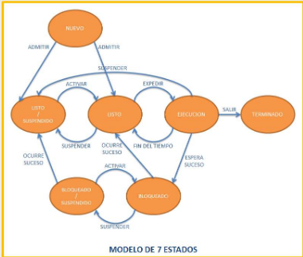

# APUNTES PROCESOS Y SERVICIOS EN JAVA
## ¿Qué es un Programa?
Son un **conjunto de instrucciones capaces de ejecutarse** en un equipo físico o virtual.

## ¿Qué es un Servicio?
Es un programa en ejecutado en segundo plano, no interacturia con el usuario.

## ¿Qué es un Proceso?
Es **cualquier programa en ejecución** bajo el control del sistema operativo.


## ¿Cuáles son los estados de un proceso?
- **Ejecución:** 
Está dentro del microprocesador.
- **Pausado/Detenido/Espera:** el **proceso sigue en ejecución**, pero el **S.O decidió dar prioridad a otro proceso**.
- **Interrumpido:** el proceso sigue en ejecución, pero el usuario decidió interrumpir la ejecución.
### Modelo 7 estados


## ¿Qué es el BCP?
Es el **Bloque de Control de Proceso**, en esta estructura **se guarda la información** de un proceso.
- Id del proceso.
- Estado del proceso.
- Contador.
- Registro de CPU.
- Prioridad del proceso.
- Información de gestión de memoria.
- Tiempo de CPU y tiempo real transcurrido.
- Información de estado E/S.

## ¿Qué es la programación multiproceso?
Es la capacidad de que múltiples procesos puedan estar ejecutándose sobre el mismo codigo de programa.

## Programación Multiproceso en Java
### Clases Para Procesos:
- **Process:** 
    - Soporta la funcionalidad básica de procesos.
    - Abstracta, no se pueden crear objetos de ella.
    - Cuenta con métodos para lanzar un proceso, saber el estado y/o controlar su ejecución.
- **ProcessBuilder:**
    - Cuenta con métodos para lanzar un proceso, saber el estado y/o controlar su ejecución.
- **Runtime:**
    - **Características:**
        - Cuenta con métodos para ejecutar comandos, consultar la cantidad de memoria disponible, etc.

## ¿Qué son los Streams?
Son clases que nos **permiten comunicarnos con el programa** y **el programa a su vez es capaz de comunicarse con el proceso hijo y el hijo con el programa.**
**InputStream:** Clase que nos permite **recibir** valores (archivos, sockets, consola).
**OutputStream:** Clase que nos permite **enviar** valores (archivos, sockets, consola).

### Explicación Flujos De Streams En Procesos.
- **Flujo con Runtime:**
    - **OutputStream:** es la **salida del proceso hijo**, el cual **para el programa** será un **'InputStream'.**
    - **InputStream:** es la **entrada del proceso hijo**,  el cual **para el programa** será un **'OutputStream'.**
    - **ErrorStream:** es la **salida de errores del proceso hijo**, el cual **para el programa** será un **'OutputStream'.**
- **Flujo con ProcessBuilder:**
    - **Características** gestiona comandos, entornos con variables, directorio de trabajo, fuente de entrada estandar y destino para la salida estandar y error.
    - **Métodos:**
        - start(): nos **permite crear un nuevo objeto de 'Process'**
        **Ejemplo:**
        ```java
        ProcessBuilder pb = new ProcessBuilder("java", "UnSaludo", "\"Hola Mundo!!\"").start();
        ```
        - environment(): devuelve las **variables de entorno del proceso.**
        - command(): devuelve y permite recibir el **nombre del proceso y sus argumentos.**
        - redirectOutput(): nos permite **redirigir la salida del proceso a un archivo.**
        - redirectInput(): nos permite **indicar que la entrada del proceso se encuentra en un archivo.**
        - redirectError(): nos permite **redirigir los errores del proceso a un archivo.**  